# Re-Architecting-Web-App-on-Amazon-Cloud

## Using AWS Elastic Beanstalk as a platform for re-architecting our web application on Amazon cloud. The main purpose of Elastic Beanstalk is to manage a resource to build our web application in the same suite

## Entire stack will be using PASS and SAS service and not directly using EC2 instances, we will be using Beanstalk, RDS, AmazonMQ and cloud front distribution, behind the sence Beanstalk will be also using S3 bucket, cloud watch for monitoring making the entire setup give very low operational overhead

### First creat security group and the keypairs

## Creating Relational Database Service(RDS), but before we create RDS we will create the Subnet groups and Parameter groups

### Subnet groups

### Parameter groups
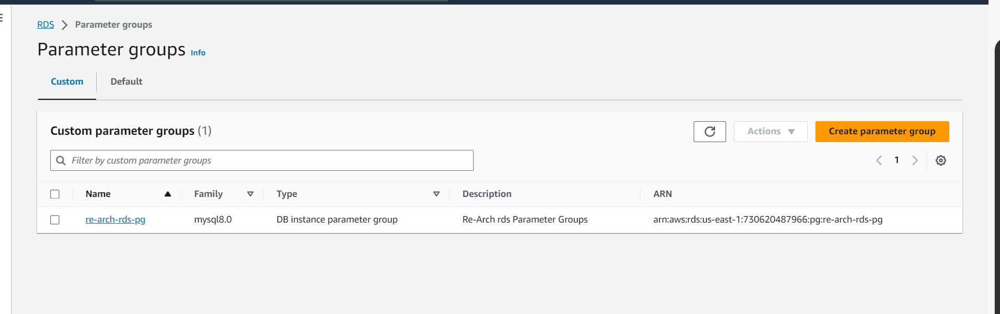

### Create RDS Database
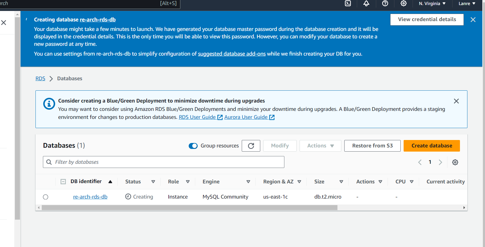

## Creating AWS ElastiCache, but before we create that, we will create subnet groups and parameter groups

### Subnet groups
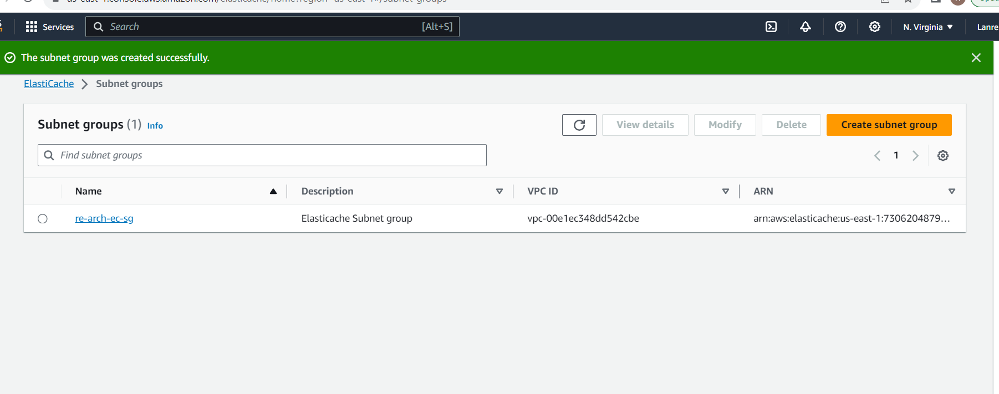

### Parameter groups
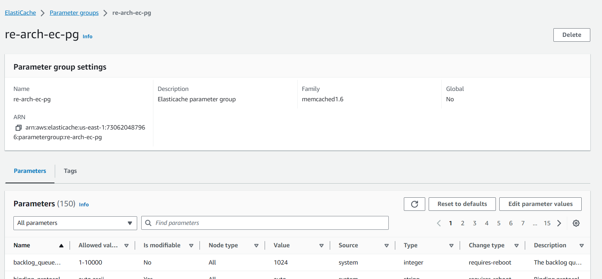

### Creating AWS Elasticache
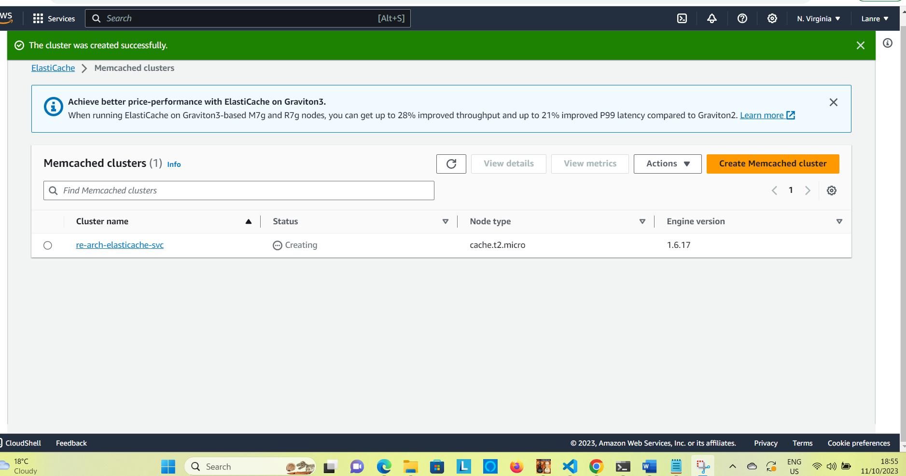

## Creating Amazon MQ for our RabbitMQ
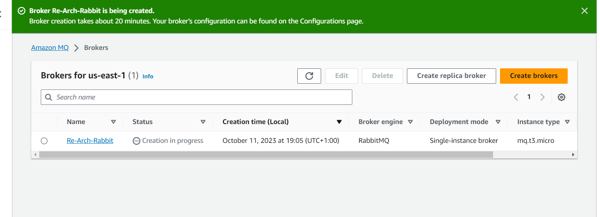

## Database Initialization

### We will run SQL queries on our instance from our source code, The instance will be lunch in the same VPC
### The only way to access our instance which is in private subnets, is through the same VPC

### Lunch instance and run and install mysql-client making sure you one of the rule allows 3306 and copy the security group id created into the backend security group

`sudo apt update && sudo apt install mysql-client -y`

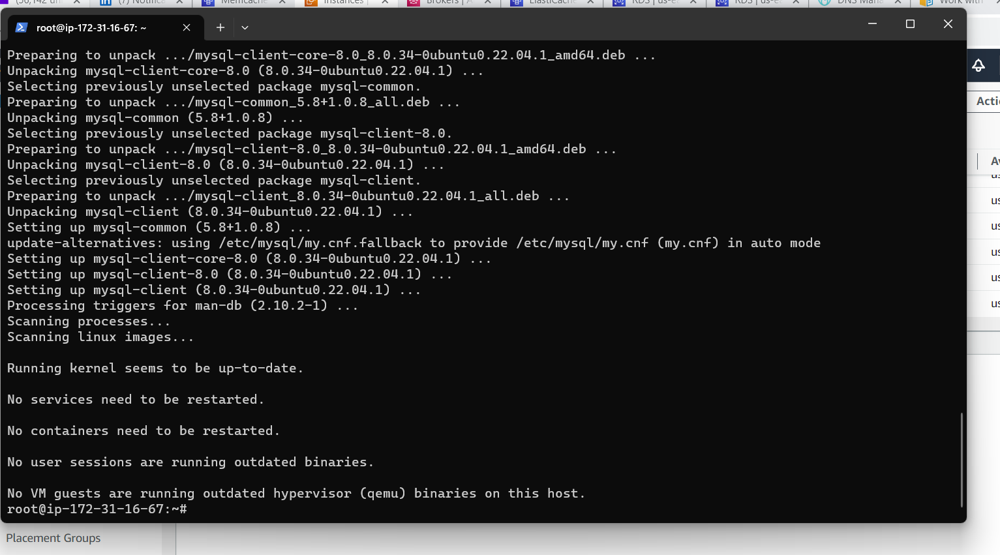

### Testing the connection for the DB

`mysql -h re-arch-rds-db.ckabsif0pmib.us-east-1.rds.amazonaws.com -u admin -pexmWjLfVhP3Tsvl accounts`

### We will see emppty set because we have not run our SQL query

### Clone source code
`git clone https://github.com/hkhcoder/vprofile-project.git`

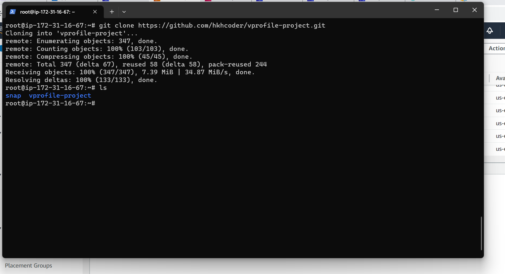

### To excute all the SQL queries on the database accounts which is on RDS

` mysql -h re-arch-rds-db.ckabsif0pmib.us-east-1.rds.amazonaws.com -u admin -pexmWjLfVhP3TsvlYH4oh accounts < src/main/resources/db_backup.sql`

### Run the queries again to test the connection

`mysql -h re-arch-rds-db.ckabsif0pmib.us-east-1.rds.amazonaws.com -u admin -pexmWjLfVhP3Tsvl accounts`

## Setting up Amazon Elastic Beanstalk

### creating roles that will be use for setting up Beanstalk

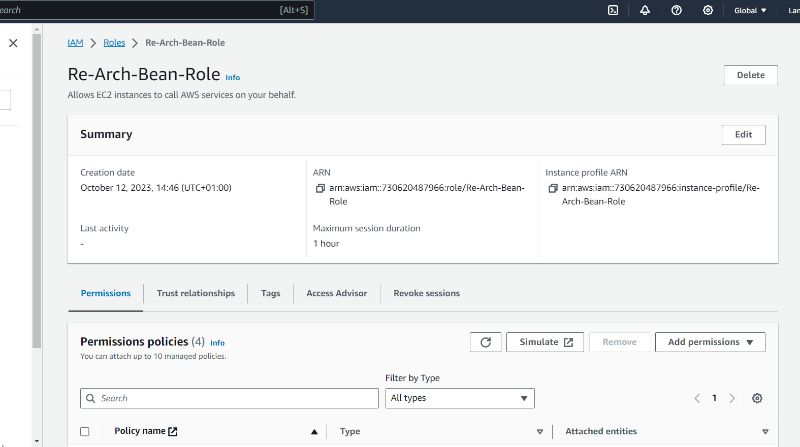

### Elastic Beanstalk

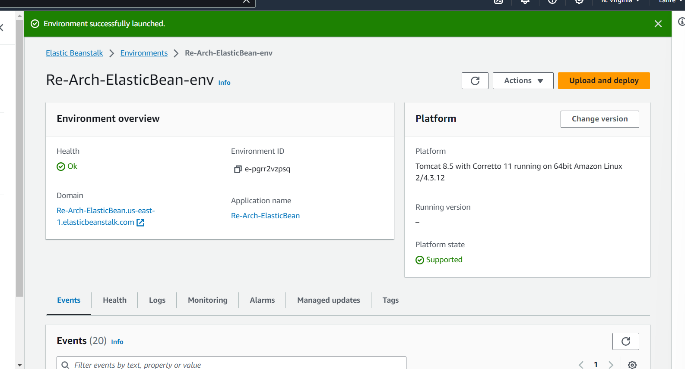

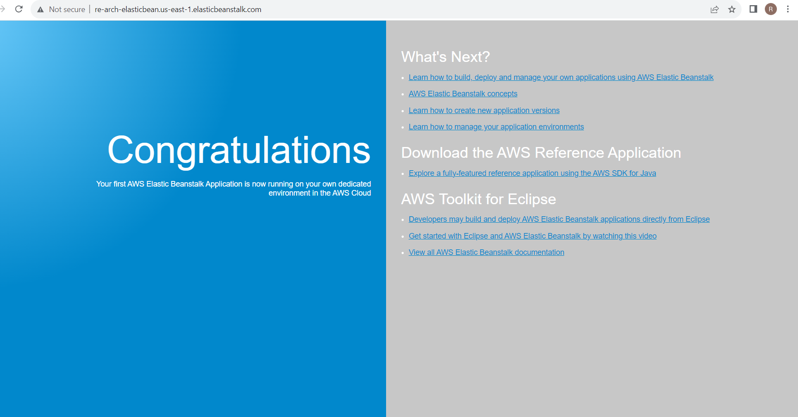

### We will 1. enable ACL(Acess Control Point) on s3 bucket, 2. Update the health check in the target group, 3.Update security group

## Build and Deploy Artifact

### Copying source code and making necesarry adjustment and entering details of the backend services in the source code (Mysql, Memcache and rabbitmq details) and validate
` cat src/main/resources/application.properties `

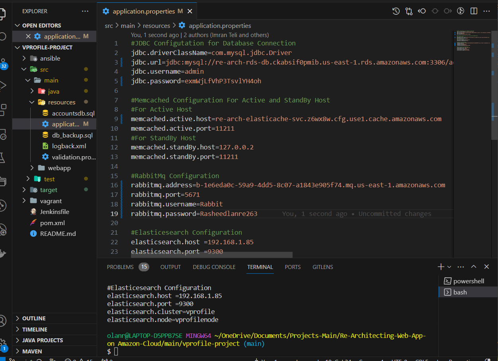

### Build our Artifact

`mvn install`

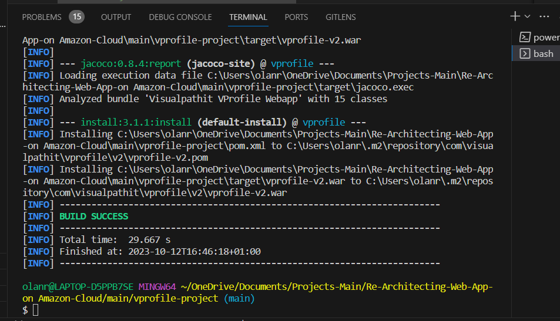

### From the Environment of the Elastic Beanstalk upload the build artifact and allow beanstalk to build

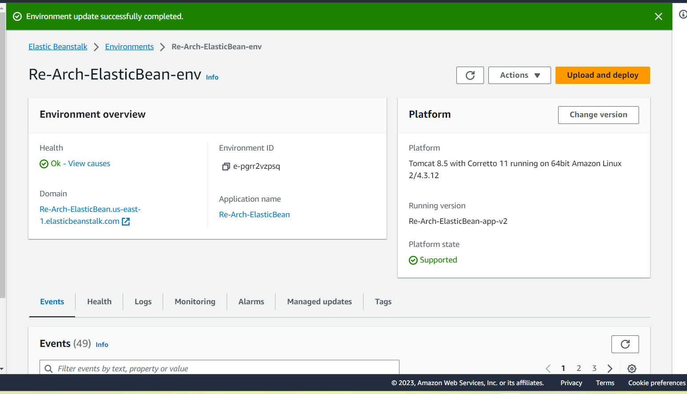

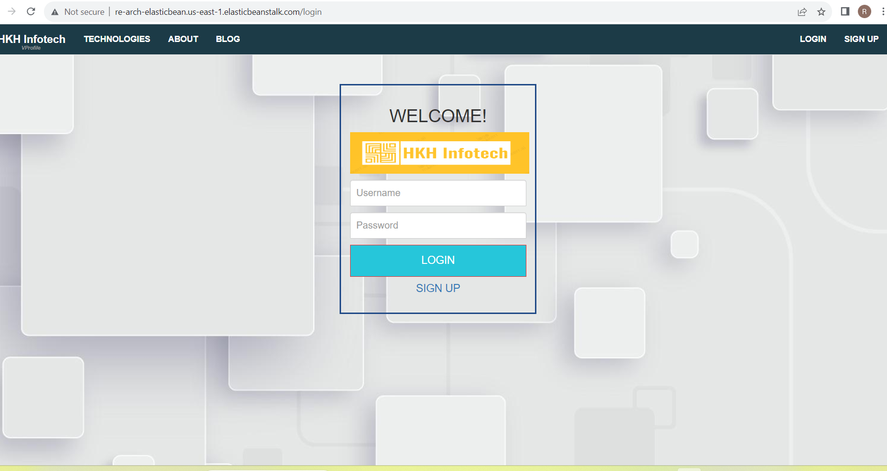

### connect through https will not work because the certificate is for a different domain

### we will solve the above through the Certificate Manager,we add the certificate to the DNS in Godday 

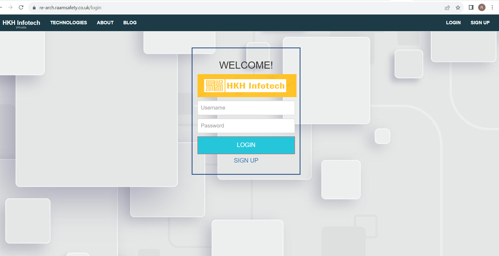

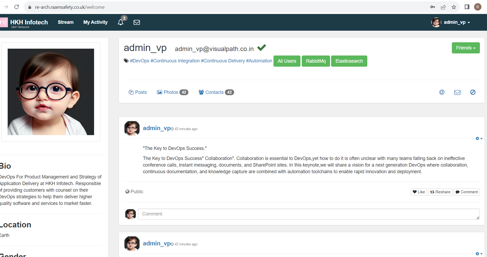

## Amazon CloudFront ..........

### validating from different brower

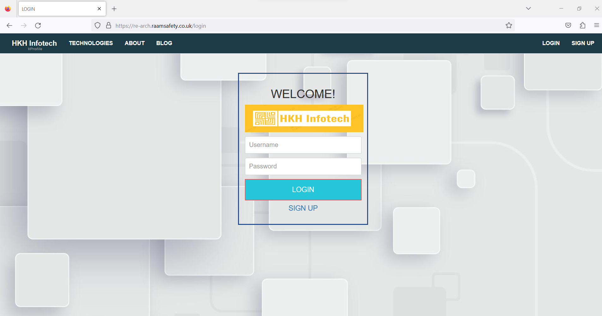

The End

